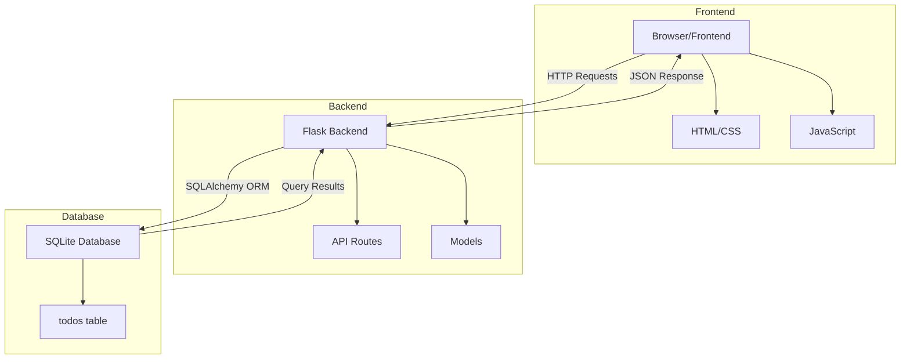
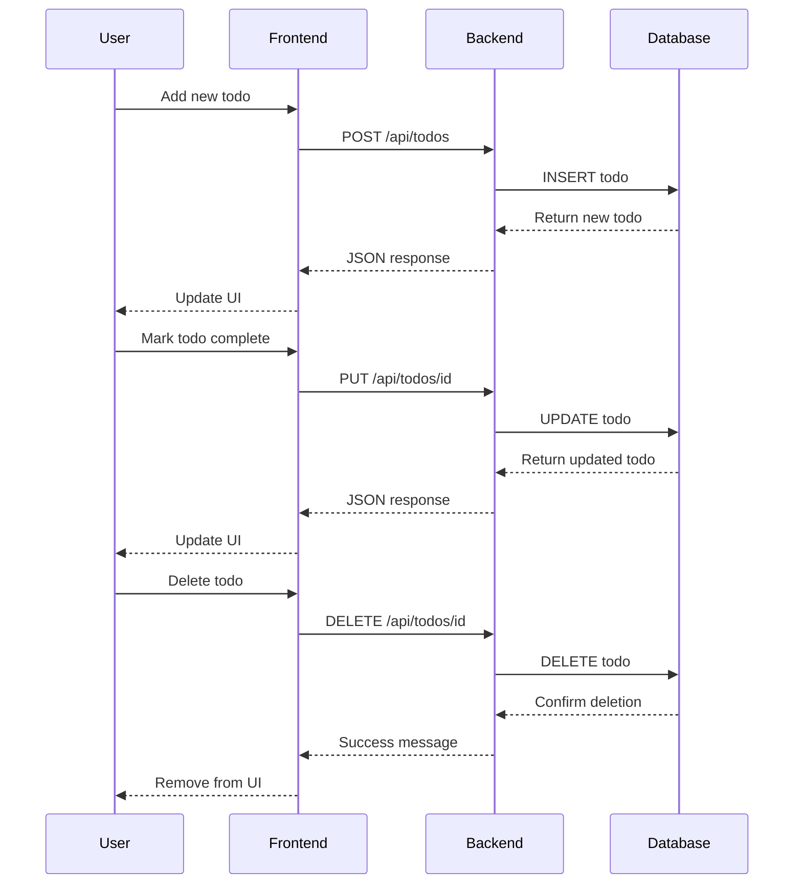

# Todo Application - Project Plan

## Overview
A simple todo application with Flask backend and vanilla JavaScript frontend, using SQLite for data persistence.

---

## 1. Project Directory Structure

```
todo-app/
├── backend/
│   ├── app.py                 # Main Flask application
│   ├── models.py              # Database models
│   ├── config.py              # Configuration settings
│   ├── requirements.txt       # Python dependencies
│   └── todos.db              # SQLite database (auto-generated)
├── frontend/
│   ├── index.html            # Main HTML page
│   ├── css/
│   │   └── style.css         # Styling
│   └── js/
│       └── app.js            # Frontend JavaScript logic
├── .gitignore
└── README.md                 # Setup and usage instructions
```

---

## 2. API Endpoints

### Base URL: `http://localhost:5000/api`

| Method | Endpoint | Description | Request Body | Response |
|--------|----------|-------------|--------------|----------|
| GET | `/todos` | Get all todos | None | `[{id, title, description, completed, created_at}]` |
| GET | `/todos/<id>` | Get single todo | None | `{id, title, description, completed, created_at}` |
| POST | `/todos` | Create new todo | `{title, description?}` | `{id, title, description, completed, created_at}` |
| PUT | `/todos/<id>` | Update todo | `{title?, description?, completed?}` | `{id, title, description, completed, created_at}` |
| DELETE | `/todos/<id>` | Delete todo | None | `{message: "Todo deleted"}` |

### Response Codes
- `200 OK` - Successful GET, PUT, DELETE
- `201 Created` - Successful POST
- `400 Bad Request` - Invalid input
- `404 Not Found` - Todo not found
- `500 Internal Server Error` - Server error

---

## 3. Database Schema

### Table: `todos`

| Column | Type | Constraints | Description |
|--------|------|-------------|-------------|
| id | INTEGER | PRIMARY KEY, AUTOINCREMENT | Unique identifier |
| title | TEXT | NOT NULL | Todo title (required) |
| description | TEXT | NULL | Optional description |
| completed | BOOLEAN | DEFAULT FALSE | Completion status |
| created_at | TIMESTAMP | DEFAULT CURRENT_TIMESTAMP | Creation timestamp |

### SQL Schema
```sql
CREATE TABLE todos (
    id INTEGER PRIMARY KEY AUTOINCREMENT,
    title TEXT NOT NULL,
    description TEXT,
    completed BOOLEAN DEFAULT 0,
    created_at TIMESTAMP DEFAULT CURRENT_TIMESTAMP
);
```

---

## 4. Technology Stack

### Backend
- **Framework**: Flask 3.0+
- **Database**: SQLite 3
- **ORM**: Flask-SQLAlchemy
- **CORS**: Flask-CORS (for cross-origin requests)
- **Python Version**: 3.8+

### Frontend
- **HTML5**: Semantic markup
- **CSS3**: Modern styling with Flexbox/Grid
- **JavaScript**: Vanilla ES6+ (no frameworks)
- **HTTP Client**: Fetch API

### Development Tools
- **Virtual Environment**: venv
- **Package Manager**: pip
- **Version Control**: Git

---

## 5. Key Features

### Backend Features
- RESTful API design
- CORS enabled for frontend communication
- Input validation
- Error handling with appropriate HTTP status codes
- SQLite database with SQLAlchemy ORM
- Automatic database initialization

### Frontend Features
- Single-page application (SPA)
- Add new todos with title and optional description
- Mark todos as complete/incomplete
- Edit existing todos
- Delete todos
- Responsive design
- Real-time UI updates
- Error handling and user feedback

---

## 6. Implementation Steps

1. **Setup Project Structure**
   - Create directory structure
   - Initialize Git repository
   - Create `.gitignore` file

2. **Backend Development**
   - Set up Python virtual environment
   - Install Flask dependencies
   - Create database models
   - Implement API endpoints
   - Add CORS support
   - Test API with curl or Postman

3. **Frontend Development**
   - Create HTML structure
   - Implement CSS styling
   - Write JavaScript for API communication
   - Add event handlers for user interactions
   - Implement DOM manipulation

4. **Integration & Testing**
   - Test all CRUD operations
   - Verify error handling
   - Test edge cases
   - Ensure responsive design

5. **Documentation**
   - Write README with setup instructions
   - Document API endpoints
   - Add usage examples

---

## 7. Dependencies

### Backend (`requirements.txt`)
```
Flask==3.0.0
Flask-SQLAlchemy==3.1.1
Flask-CORS==4.0.0
```

### Frontend
No external dependencies - using vanilla JavaScript

---

## 8. Configuration

### Backend Configuration
- **Host**: `0.0.0.0` (accessible from network)
- **Port**: `5000`
- **Debug Mode**: `True` (development only)
- **Database**: `sqlite:///todos.db`

### CORS Configuration
- Allow all origins in development
- Restrict in production

---

## 9. Security Considerations

For this basic application:
- Input validation on backend
- SQL injection prevention via SQLAlchemy ORM
- XSS prevention through proper DOM manipulation

For production enhancement:
- Add authentication/authorization
- Implement rate limiting
- Use environment variables for configuration
- Add HTTPS
- Implement CSRF protection

---

## 10. Future Enhancements

Potential features to add later:
- User authentication
- Todo categories/tags
- Due dates and reminders
- Priority levels
- Search and filter functionality
- Drag-and-drop reordering
- Dark mode toggle
- Export/import todos
- Multiple todo lists

---

## Architecture Diagram



---

## API Flow Diagram



---

## Getting Started

Once implemented, the application will be started with:

1. **Backend**:
   ```bash
   cd backend
   python -m venv venv
   source venv/bin/activate  # On Windows: venv\Scripts\activate
   pip install -r requirements.txt
   python app.py
   ```

2. **Frontend**:
   - Open `frontend/index.html` in a browser, or
   - Use a simple HTTP server: `python -m http.server 8000`

The application will be accessible at `http://localhost:8000` (frontend) communicating with `http://localhost:5000` (backend).

---

## Success Criteria

The project will be considered complete when:
- ✅ All CRUD operations work correctly
- ✅ Frontend communicates successfully with backend
- ✅ Data persists in SQLite database
- ✅ UI is responsive and user-friendly
- ✅ Error handling works properly
- ✅ README documentation is complete